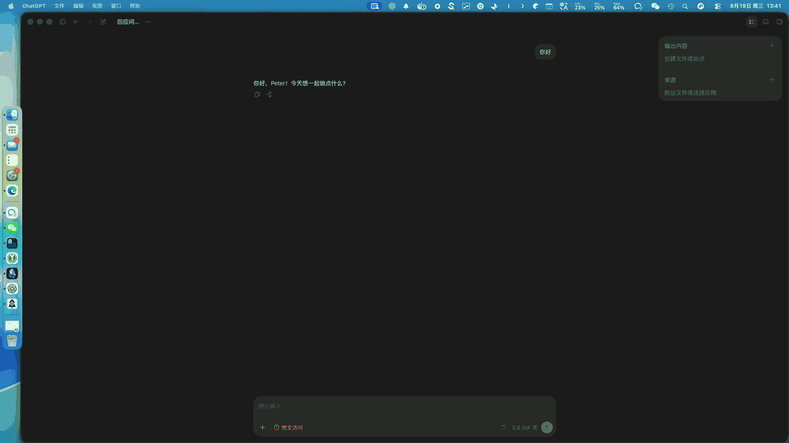
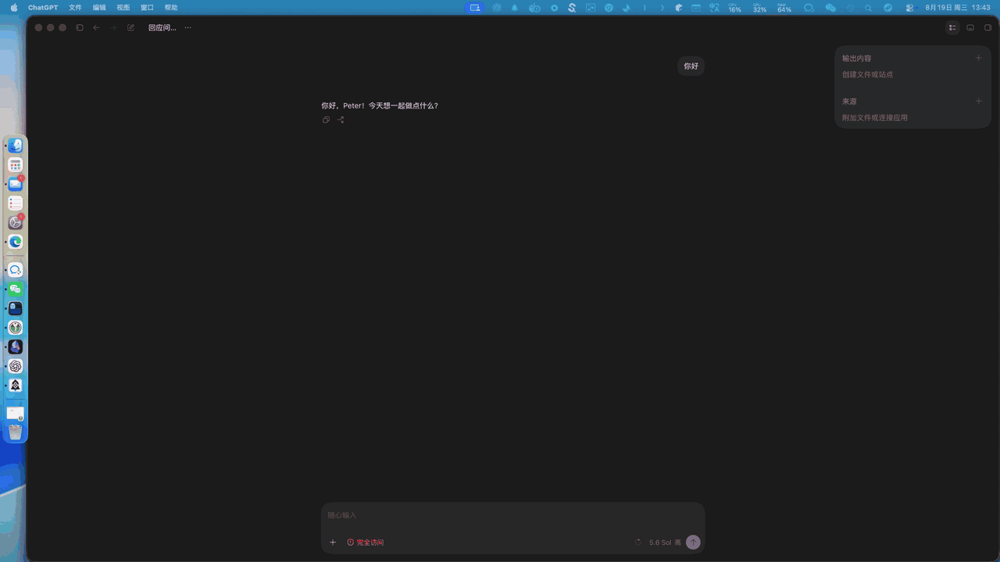

<p align="center">
  
</p>

<h1 align="center">CueDex</h1>

<p align="center"><strong>Know when Codex is done, even when you are looking elsewhere.</strong></p>

<p align="center">
  A lightweight native macOS utility that uses screen-edge glow, sound, or speech<br>
  when the main Codex agent finishes responding.
</p>

<p align="center">
  <a href="README.md">English</a> · <a href="README.zh-CN.md">简体中文</a>
</p>

<p align="center">
  <a href="https://github.com/def-peter/CueDex/releases/latest"></a>
  <a href="https://github.com/def-peter/CueDex/releases"></a>
  
  <a href="https://github.com/def-peter/CueDex/actions/workflows/release.yml"></a>
  <a href="https://github.com/def-peter/CueDex/stargazers"></a>
  <a href="LICENSE"></a>
</p>

CueDex is useful when a Codex task takes long enough for you to switch to another window or step away. It listens for the completion event locally and gives you a visible or audible cue without persisting or sending the conversation.

## ✨ See It in Action

<table>
  <tr>
    <td align="center" width="50%">
      
      <br><sub><strong>Breathing glow</strong> · one color, soft rise and fade</sub>
    </td>
    <td align="center" width="50%">
      
      <br><sub><strong>Two-color flash</strong> · alternating edge light, red and blue by default</sub>
    </td>
  </tr>
</table>

The recordings show CueDex running around a real macOS Codex workspace. Colors, intensity, and duration are configurable.

## 🔔 Features

- Main-agent completion events through the Codex `Stop` lifecycle hook; subagent completions are ignored
- GPU-driven monochrome breathing glow or two-color emergency-style edge flash across every connected display
- Custom colors, intensity, duration, macOS sounds, imported audio, and volume
- Custom spoken messages and system voices through Apple's native `AVSpeechSynthesizer`
- Pause, quiet hours, launch at login, and one-click cue previews
- Runtime Simplified Chinese and English switching, with Chinese as the default
- Lightweight daily GitHub Release checks plus a manual check in About
- Event-driven local processing with no polling, analytics, or prompt/response storage

## 📥 Install

**Requirements:** macOS 14 or later, on either Intel or Apple silicon.

1. Download the correct DMG from the [latest GitHub Release](https://github.com/def-peter/CueDex/releases/latest): `arm64` for Apple silicon (M1 or later), or `x86_64` for Intel.
2. Open the DMG and move `CueDex.app` to `/Applications`.
3. Launch CueDex and complete the Codex integration steps below.

> [!IMPORTANT]
> CueDex is ad-hoc signed but is not notarized because it does not currently use
> a paid Apple Developer ID certificate. macOS may block the first launch or say
> that it cannot verify the developer. This is an expected Gatekeeper warning,
> not a malware detection. Open **System Settings > Privacy & Security**, find
> the CueDex message, choose **Open Anyway**, and confirm.

Every Release includes a SHA-256 file for verifying download integrity.

## Connect to Codex

1. Open CueDex and select **General > Enable Integration**.
2. CueDex adds its `Stop` handler to `~/.codex/hooks.json` without replacing other hooks or an existing `notify` command.
3. Open **Codex Settings > Hooks** and review and trust the CueDex hook.
4. If the hook does not appear, restart ChatGPT and check again.

Once trusted, CueDex stays in the menu bar and responds only when the main agent finishes with a new assistant message.

## How It Works

Codex invokes a small local helper for the main agent's `Stop` event. The helper validates that the turn contains a new assistant message, deduplicates repeated `turn_id` values, writes an empty event marker under `~/Library/Application Support/CueDex`, and wakes the app. A dispatch file-system source consumes fresh markers without polling.

Prompt and response content are never persisted or sent anywhere. CueDex only contacts the GitHub Releases API for its low-frequency update check.

## Development

Build and launch the Debug app with the Codex Run action or:

```bash
./script/build_and_run.sh
```

Run unit and UI tests:

```bash
xcodebuild -project CueDex.xcodeproj -scheme CueDex \
  -destination 'platform=macOS' \
  -derivedDataPath .build/TestDerivedData \
  CODE_SIGNING_ALLOWED=NO test
```

## Packaging and Release

Build an unsigned, universal DMG for Intel and Apple silicon:

```bash
./script/package_unsigned.sh
```

Or build one architecture:

```bash
./script/package_unsigned.sh --arch x86_64
./script/package_unsigned.sh --arch arm64
```

To publish a new version from `main`:

```bash
./script/release.sh
```

The release script updates the version and build number, creates the release commit and tag, and pushes them to GitHub. GitHub Actions builds separate `x86_64` and `arm64` DMGs, verifies their SHA-256 checksums, and attaches all artifacts to the Release.

Use `./script/release.sh --dry-run --version <x.y.z>` to preview the release without modifying files, commits, tags, or remotes.

## 💬 Feedback

Bug reports and feature ideas are welcome in [GitHub Issues](https://github.com/def-peter/CueDex/issues), or by email at [guanzhen.li@foxmail.com](mailto:guanzhen.li@foxmail.com).

## ⭐ Star History

If CueDex is useful to you, a star helps more people find it.

[](https://www.star-history.com/#def-peter/CueDex&Date)

## License

Created by Peter Li. CueDex is available under the [MIT License](LICENSE).
